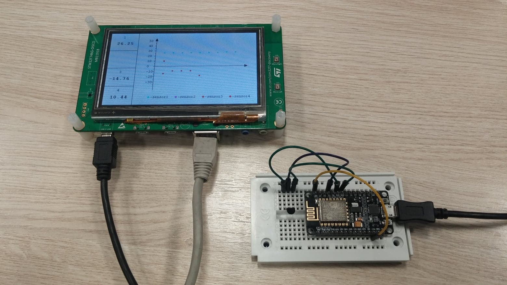
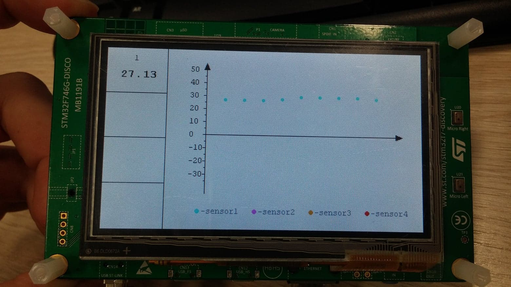
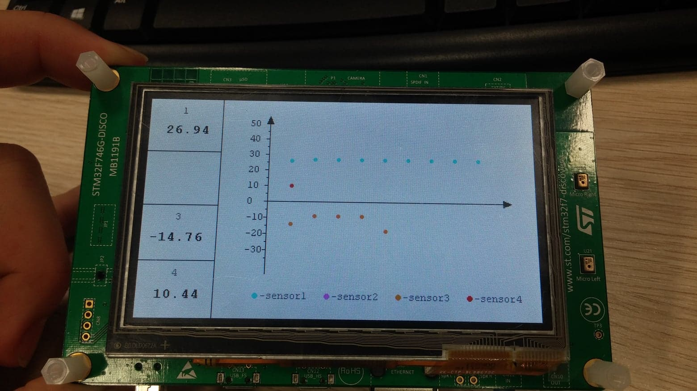
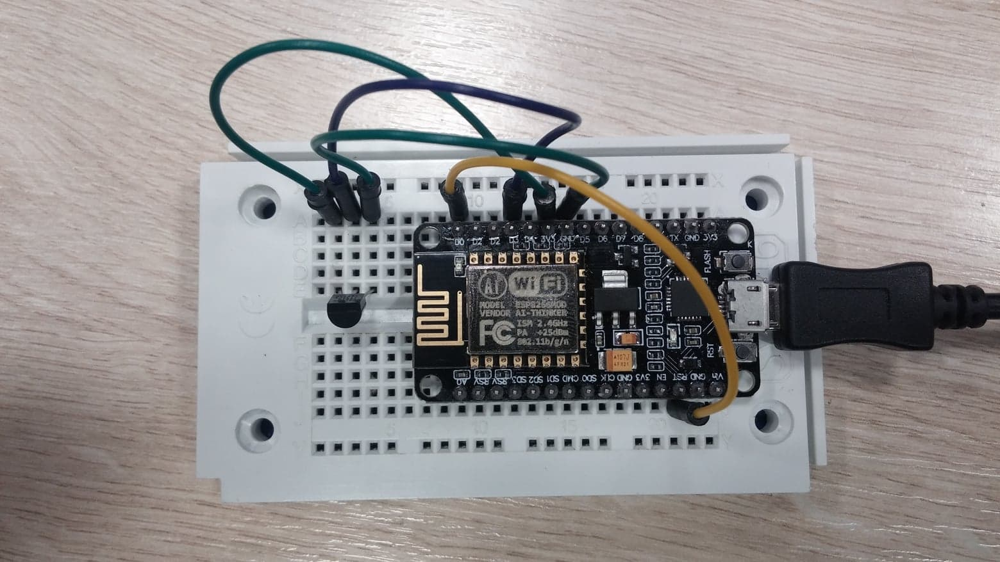
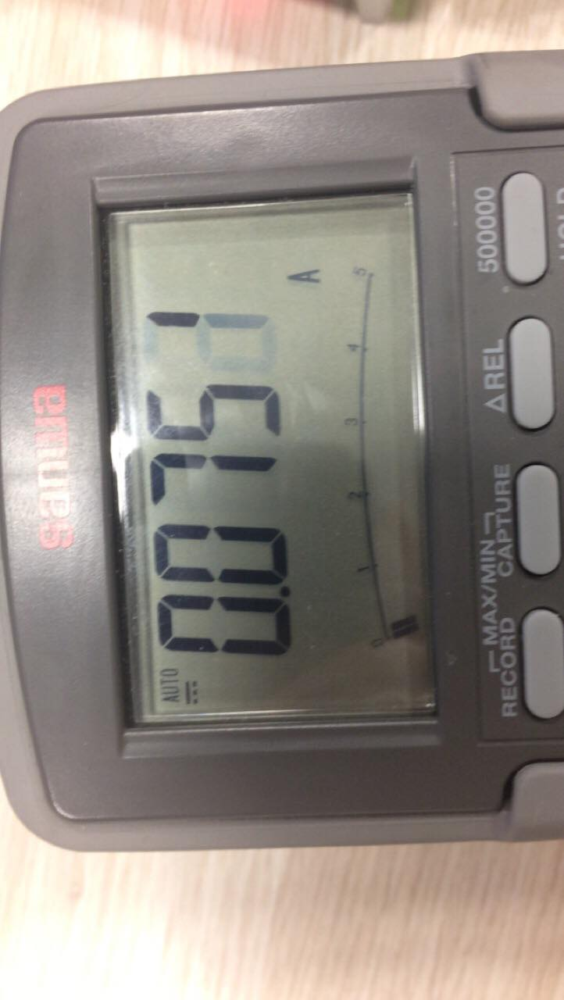
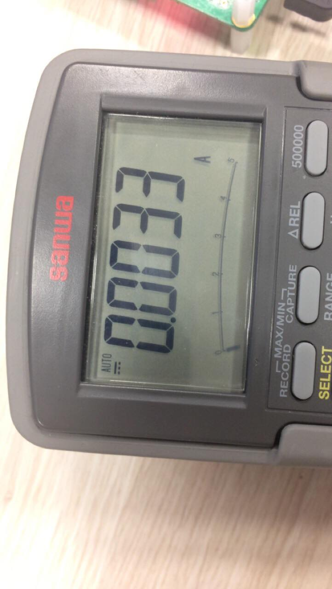
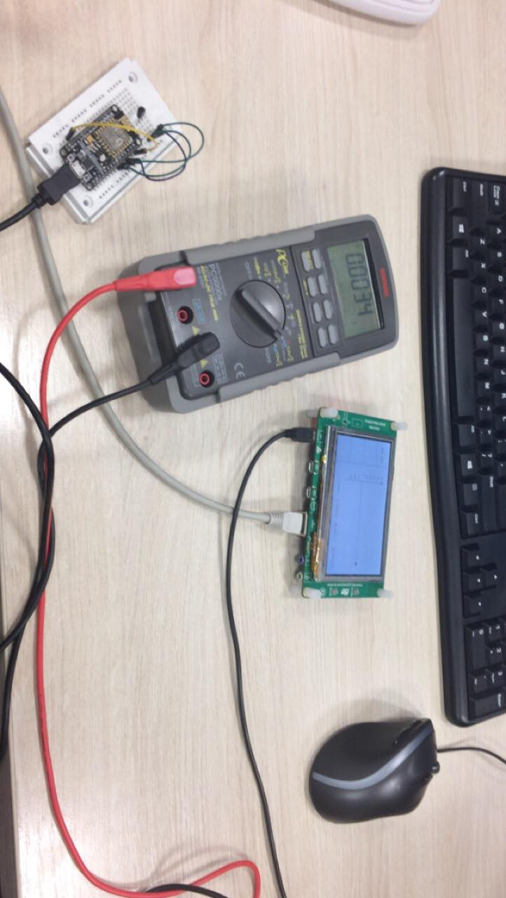
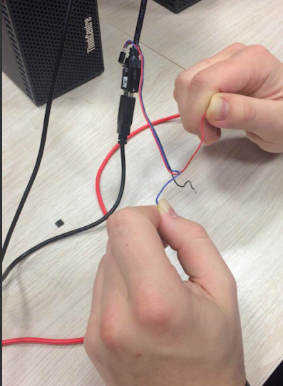

# TMS - Temperature Measure Station

Ludwi Ciechański  
Jakub Sroka

github: https://github.com/Numernabis/TMS
## Wstęp

W ramach przeprowadzonych prac wykonano model rozproszonego systemu pomiaru temperatury w czasie rzeczywistym. Modelowany system składa się z głównej stacji pomiarowej będącej serwerem http, wyposażony w interfejs graficzny oraz obsługujący do czterech sensorów wysyłających cyklicznie pomiary. Sensory są energooszczędne i w czasie, kiedy nie prowadzą pomiarów, usypiają się na stałą długość czasu.



## MeasureStation

Realizacje projektu inżynierskiego oparliśmy o projekt startowy dla płytki STM32F746G-DISCO, dostępny pod adresem: [link](http://home.agh.edu.pl/~rabw/sw/swlab.html). 
Po odpowiednim uporządkowaniu oraz oczyszczeniu kodu z niepotrzebnych nam funkcjonalności, zaimplementowaliśmy zaplanowane. 
Na początku zadeklarowaliśmy kilka potrzebnych nam stałych i zmiennych oraz zdefiniowaliśmy funkcje 
pomocnicze.

[kod stacji pomiarowej](#kodmeasurestation)

### Serwer HTTP

W projekcie startowym znajdował się już szkic serwera HTTP.
Poniżej przedstawiamy zmiany, które zostały dokonane w istniejącym projekcie w funkcji `http_server_serve`.

[kod serwera http](#kodhttp)

Zgodnie z ponizszym kodem oraz zamieszczonymi w nim komentarzami, przygotowaliśmy nasz serwer do obsługi dwóch rodzajów komend: 

1. GET /getid - która zwraca id dla nowo podłączonej stacji pomiarowej
2. GET /id=xx/temp=sxx.xx - która pozwala na przekazanie pomiaru przy użyciu wcześniej uzyskanego id oraz pomiaru w zdefiniowanym formacie, gdzie s oznacza znak, a x jest dowolną cyfrą w systemie dziesiętnym. 
   
Do przesłania informacji używamy protokołu HTTP/1.1, a wiadomości przesyłane są jako text.


### Interfejs graficzny 

Przygotowaliśmy prosty i schludny interfejs. Mozliwe jest śledzenie do 4 sensorów(pomiary real-time).
Dodatkowo na podstawie danych z kilku ostatnich pomiarów rysowany jest wykres prównujący pomiary róznych sensorów.

[kod interfejsu graficznego](#kodinterface)





## Sensor

Sensory ESP8266 (nodeMCU) działają według powtarzającego się cyklu. Nowo uruchumiony sensor wysyła zapytranie do serwera http z prośbą o przydzielenie mu unikalnego adresu id. Adres ten po otrzymaniu zapisywany jest w pamięci trwałej mikroprocesora. Następnie mikroprocesor dokonuje programu, wysyła pomiar z odpowiednim adresem identyfikującym i przechodzi w stan spoczynku(deep-sleep). Po wybudzeniu następuje odczytanie id z pamięci trwałej(pamięć ulotna została wymazana) i cykl powtarza się.

[kod sensora](#kodsensor)

Do stworzenia oprogramowania płytki ESP8266 (nodeMCU) wykorzystaliśmy następujące przykłady:
1. obsługa jednego lub wielusensorów DS18B20: [link 1](https://www.instructables.com/id/ESP8266-and-Multiple-Temperature-Sensors-DS18b20-W/)
2. klient HTTP, wysyłający pomiary metodą GET: [link 2](https://circuits4you.com/2018/03/10/esp8266-http-get-request-example/)
3. energooszczędność, z użyciem funkcji _deep-sleep_: [link 3]( https://www.losant.com/blog/making-the-esp8266-low-powered-with-deep-sleep )




### Energooszczędność

Podczas laboratorium wykonaliśmy pomiary średniego natężenia prądu pobieranego przez sensor (nodeMCU).
Wyniki są następujące:

1. stan pracy : 75 mA
2. stan uśpienia : 3.1 mA





Natomiast dla stablizatora AMS1117 3.3 LD 518, parametr _Quiescent Current_ wynosi 5 mA (dla 12 V) 
(zgodnie z dokumentacją, źródło: [link](http://html.alldatasheet.com/html-pdf/205691/ADMOS/AMS1117-3.3/474/3/AMS1117-3.3.html)
lub [link](http://www.advanced-monolithic.com/pdf/ds1117.pdf))






#### <a name="kodmeasurestation"> </a>
## MeasureStation [kod programu]

```c
#define BUFFER_SIZE 500
#define MAX_SENSORS 4
#define MAX_MEASUREMENTS 10
#define NR_LEVELS 10

static double measurements[MAX_SENSORS][MAX_MEASUREMENTS];
static char response[BUFFER_SIZE];
static char id[3];
static char sign;
static char temperatureIntegerPart[3];
static char temperatureDecimalPart[3];
static int sensorMinId = 1;

void clear_response_buffer()
{
  for (int i = 0; i < BUFFER_SIZE; i++)
  {
    response[i] = 0;
  }
}

void save_measurement(int id, double measurement)
{
  for (int i = MAX_MEASUREMENTS - 1; i > 0; i--)
  {
    measurements[id][i] = measurements[id][i - 1];
  }
  measurements[id][0] = measurement;
}

uint32_t choose_color(int id)
{
  uint32_t color = LCD_COLOR_BLACK;
  switch (id)
  {
  case 0:
    color = LCD_COLOR_CYAN;
    break;
  case 1:
    color = LCD_COLOR_MAGENTA;
    break;
  case 2:
    color = LCD_COLOR_ORANGE;
    break;
  case 3:
    color = LCD_COLOR_RED;
    break;
  default:
    break;
  }
  return color;
}
```
#### <a name="kodinterface"> </a>
### Interfejs graficzny [kod programu]

```c
//partially based on available code examples
static void lcd_start(void)
{
  /* LCD Initialization */
  BSP_LCD_Init();

  /* LCD Initialization */
  BSP_LCD_LayerDefaultInit(0, (unsigned int)0xC0000000);
  //BSP_LCD_LayerDefaultInit(1, (unsigned int)lcd_image_bg+(LCD_X_SIZE*LCD_Y_SIZE*4));
  BSP_LCD_LayerDefaultInit(1, (unsigned int)0xC0000000 + (LCD_X_SIZE * LCD_Y_SIZE * 4));

  /* Enable the LCD */
  BSP_LCD_DisplayOn();

  /* Select the LCD Background Layer  */
  BSP_LCD_SelectLayer(0);

  /* Clear the Background Layer */
  BSP_LCD_Clear(LCD_COLOR_WHITE);
  BSP_LCD_SetBackColor(LCD_COLOR_WHITE);

  BSP_LCD_SetColorKeying(1, LCD_COLOR_WHITE);

  /* Select the LCD Foreground Layer  */
  BSP_LCD_SelectLayer(1);

  /* Clear the Foreground Layer */
  BSP_LCD_Clear(LCD_COLOR_WHITE);
  BSP_LCD_SetBackColor(LCD_COLOR_WHITE);

  /* Configure the transparency for foreground and background :
     Increase the transparency */
  BSP_LCD_SetTransparency(0, 255);
  BSP_LCD_SetTransparency(1, 255);
}

void draw_background(void)
{
  /* Select the LCD Background Layer  */
  BSP_LCD_SelectLayer(0);
  BSP_LCD_SetTextColor(LCD_COLOR_DARKGRAY);

  /* Draw simple grid for sensors display */
  BSP_LCD_DrawVLine(90, 0, LCD_Y_SIZE);
  BSP_LCD_DrawHLine(0, 68, 90);
  BSP_LCD_DrawHLine(0, 136, 90);
  BSP_LCD_DrawHLine(0, 204, 90);

  /* Temperature axes with darts */
  BSP_LCD_SetTextColor(LCD_COLOR_BLACK);
  BSP_LCD_SetFont(&Font12);

  /* Axis Y */
  uint16_t AY_x = 150;
  uint16_t AY_y = 20;
  uint16_t AY_length = 200;
  BSP_LCD_DrawVLine(AY_x, AY_y, AY_length);

  /* Axis Y dart */
  Point y1, y2, y3;
  y1.X = AY_x;
  y1.Y = AY_y;
  y2.X = AY_x + 4;
  y2.Y = AY_y + 10;
  y3.X = AY_x - 4;
  y3.Y = AY_y + 10;
  Point pointsY[3] = {y1, y2, y3};
  BSP_LCD_FillPolygon(pointsY, 3);

  /* Axis Y scale */
  for (int y = 30, t = 50; y < 220 && t > -40; y += 20, t -= 10)
  {
    BSP_LCD_DrawHLine(146, y, 4);
    char buf[] = "";
    sprintf(buf, "%d", t);
    BSP_LCD_DisplayStringAt(125, y - 5, (uint8_t *)buf, LEFT_MODE);
  }
  for (int y = 40; y < 220; y += 20)
  {
    BSP_LCD_DrawHLine(148, y, 2);
  }

  /* Axis X */
  uint16_t AX_x = 450;
  uint16_t AX_y = 130;
  uint16_t AX_length = 300;
  BSP_LCD_DrawHLine(AX_x - AX_length, AX_y, AX_length);

  /* Axis X dart */
  Point x1, x2, x3;
  x1.X = AX_x;
  x1.Y = AX_y;
  x2.X = AX_x - 10;
  x2.Y = AX_y + 4;
  x3.X = AX_x - 10;
  x3.Y = AX_y - 4;
  Point pointsX[3] = {x1, x2, x3};
  BSP_LCD_FillPolygon(pointsX, 3);

  /* Plot caption */
  for (int id = 0; id < MAX_SENSORS; id++)
  {
    uint32_t color = choose_color(id);
    BSP_LCD_SetTextColor(color);
    BSP_LCD_FillCircle(140 + id * 85, 245, 3);

    char buf[] = "";
    sprintf(buf, "-sensor%d", id + 1);
    BSP_LCD_SetTextColor(LCD_COLOR_GRAY);
    BSP_LCD_SetFont(&Font12);
    BSP_LCD_DisplayStringAt(146 + id * 85, 240, (uint8_t *)buf, LEFT_MODE);
  }

  /* Select the LCD Foreground Layer */
  BSP_LCD_SelectLayer(1);
}

void update_plot()
{
  /* Plot coordinates and constants */
  uint16_t X_0 = 150;
  uint16_t X_length = 290;
  uint16_t Y_0 = 130;
  /*
  uint16_t Y_min = 210;
  uint16_t Y_max = 30;
  int16_t Y_value_min = -40;
  int16_t Y_value_max = 50;
  (Y_0 - Y_max) / Y_value_max = 2
  (Y_0 - Y_min) / Y_value_min = 2
  */

  /* Clear area of plot (without axes) */
  BSP_LCD_SetTextColor(LCD_COLOR_WHITE);
  BSP_LCD_FillRect(150, 30, 290, 100);
  BSP_LCD_FillRect(150, 130, 290, 90);

  /* Display measurment matrix */
  for (int id = 0; id < MAX_SENSORS; id++)
  {
    /* Choose color for one sensor */
    uint32_t color = choose_color(id);
    BSP_LCD_SetTextColor(color);

    /* Display last values from one sensor */
    for (int i = 0; i < MAX_MEASUREMENTS - 1; i++)
    {
      double value = measurements[id][i];
      if (value == -404)
        continue;

      uint16_t y = Y_0 - value * 2;
      uint16_t x = X_0 + (i + 1) * (X_length / MAX_MEASUREMENTS);
      BSP_LCD_FillCircle(x, y, 2);
    }
  }
}

void update_sensor_display(int id, char sign, int temperatureInteger, int temperatureDecimal)
{
  /* Display id of sensor */
  BSP_LCD_SetTextColor(LCD_COLOR_GRAY);
  BSP_LCD_SetFont(&Font12);

  char id_buf[] = {0};
  sprintf(id_buf, "%d", id);
  BSP_LCD_DisplayStringAt(40, 10 + (id - 1) * 68, (uint8_t *)id_buf, LEFT_MODE);

  /* Clear line of previous measurment */
  BSP_LCD_SetTextColor(LCD_COLOR_WHITE);
  BSP_LCD_FillRect(10, 34 + (id - 1) * 68, 64, 25);

  /* Display value of latest measurement */
  BSP_LCD_SetTextColor(LCD_COLOR_BLACK);
  BSP_LCD_SetFont(&Font16);

  char temp_buf[6] = {0};
  sprintf(temp_buf, "%d", temperatureInteger);
  temp_buf[2] = '.';
  sprintf(temp_buf + 3, "%d", temperatureDecimal);
  BSP_LCD_DisplayStringAt(20, 34 + (id - 1) * 68, (uint8_t *)temp_buf, LEFT_MODE);
  
   /* Display sign, only if temperature is negative */
  if (sign == '-')
  {
    BSP_LCD_DisplayChar(10, 34 + (id - 1) * 68, sign);
  }
}

void clear_sensor_display(int id)
{
  /* Clear one quarter if sensor goes away */
  BSP_LCD_SetTextColor(LCD_COLOR_WHITE);
  BSP_LCD_FillRect(0, 1 + (id - 1) * 68, 89, 67);
}
```

#### <a name="kodhttp"> </a>
### Serwer HTTP [kod programu]


```c
//based on available code examples
static void http_server_serve(struct netconn *conn)
{
  xprintf(".");
  struct netbuf *inbuf;
  err_t recv_err;
  char *buf;
  u16_t buflen;

  /* Read the data from the port, blocking if nothing yet there. 
   We assume the request (the part we care about) is in one netbuf */
  recv_err = netconn_recv(conn, &inbuf);

  if (recv_err == ERR_OK)
  {
    if (netconn_err(conn) == ERR_OK)
    {
      netbuf_data(inbuf, (void **)&buf, &buflen);
      void clear_response_buffer();
      /* Is this an HTTP GET command? is it request for machine id?*/
      if ((buflen >= 10) && (strncmp(buf, "GET /getid", 10) == 0))
      {
        strcpy(response, "HTTP/1.1 200 OK\r\n\
          Content-Type: text/html\r\n\
          Connection: close\r\n\n"
        );
		    char *id = malloc(sizeof(char) * 2);
        sprintf(id, "0%d", sensorMinId);
		    strcat(response, id);
		    sensorMinId += 1;
        netconn_write(conn, response, sizeof(response), NETCONN_NOCOPY);
      }

      /*
        Post the measure by get request the format is as follow 'GET /id=xx/temp=sxx.xx'
        We will parse the temperature for the machine of given id and then add it to measurements history
      */
      if ((buflen >= 21) && (strncmp(buf, "GET /id=", 8) == 0))
      {
        for (int i = 0; i < 2; i++)
        {
          id[i] = buf[8 + i];
        }
		    sign = buf[16];
        for (int i = 0; i < 2; i++)
        {
          temperatureIntegerPart[i] = buf[17 + i];
          temperatureDecimalPart[i] = buf[20 + i];
        }
        id[2] = 0;
        temperatureIntegerPart[2] = 0;
        temperatureDecimalPart[2] = 0;

        int machineId;
        sscanf(id, "%d", &machineId);
        int temperatureInteger;
        sscanf(temperatureIntegerPart, "%d", &temperatureInteger);
        int temperatureDecimal;
        sscanf(temperatureDecimalPart, "%d", &temperatureDecimal);

        double temperature;
        if (sign == '+') 
        {
          temperature = temperatureInteger + (temperatureDecimal / 100);
        }
        else if (sign == '-')
        {
          temperature = - temperatureInteger - (temperatureDecimal / 100);
        }
        else
        {
          temperature = -404; //error
        }
        save_measurement(machineId - 1, temperature);
        update_sensor_display(machineId, sign, temperatureInteger, temperatureDecimal);
        update_plot();

        response[0] = 0;
        strcpy(response, "HTTP/1.1 200 OK\r\n\
          Content-Type: text/html\r\n\
          Connection: close\r\n\n\
          Ok \r\n"
        );
        netconn_write(conn, response, sizeof(response), NETCONN_NOCOPY);
      }
    }
  }
  /* Close the connection (server closes in HTTP) */
  netconn_close(conn);

  /* Delete the buffer (netconn_recv gives us ownership,
   so we have to make sure to deallocate the buffer) */
  netbuf_delete(inbuf);
}
```

#### <a name="kodsensor"> </a>
## Sensor [kod programu]
```c
/* Credentials for local WiFi */
const char *ssid = "esp";
const char *password = "haslo8266";

/* IP of MeasureStation (STM32F7) */
String host = "http://192.168.0.102"; // static routing

/* ID of sensor (ESP8266) */
String id;
```

setup:
```c
void setup()
{
  delay(1000);
  Serial.begin(115200);
  WiFi.mode(WIFI_OFF); //Prevents reconnection issue (taking too long to connect)
  delay(1000);
  WiFi.mode(WIFI_STA); //This line hides the viewing of ESP as wifi hotspot

  WiFi.begin(ssid, password); //Connect to your WiFi router
  Serial.println("");

  Serial.print("Connecting");
  // Wait for connection
  while (WiFi.status() != WL_CONNECTED)
  {
    delay(500);
    Serial.print(".");
  }

  //If connection successful show IP address in serial monitor
  Serial.println("");
  Serial.print("Connected to ");
  Serial.println(ssid);
  Serial.print("IP address: ");
  Serial.println(WiFi.localIP()); //IP address assigned to your ESP

  //Setup DS18b20 temperature sensor
  SetupDS18B20();

  //-------------------------------------------------

  HTTPClient http; //Declare object of class HTTPClient
  String measure, Link;
  float tempC;
  String path = "/id.txt";

  SPIFFS.begin();

  if (SPIFFS.exists(path))
  {
    //read id
    File f = SPIFFS.open(path, "r");
    id = f.readStringUntil('\n');
    f.close();
  }
  else
  {
    Link = host + String("/getid");
    http.begin(Link);
    int httpCode = http.GET();
    String payload = http.getString();
    id = payload; 
    http.end();

    Serial.println(id);
    
    //save id in file
    File f = SPIFFS.open(path, "w");
    
    if(!f){
      Serial.println("failed1");
    }
    f.println(id);
    f.close();  
  }

  /* Get measure from DS18B20 sensor */
  for (int i = 0; i < numberOfDevices; i++)
  {
    tempC = DS18B20.getTempC(devAddr[i]); //Measuring temperature in Celsius
  }
  DS18B20.setWaitForConversion(false); //No waiting for measurement
  DS18B20.requestTemperatures();       //Initiate the temperature measurement

  /* Compose string to send via GET method */
  measure = String(tempC);
  if (tempC < 0)
  {
    measure = String("-") + measure;
  }
  else
  {
    measure = String("+") + measure;
  }
  Link = host + String("/id=") +  id.substring(0,2) +  String("/temp=") + measure;
  Serial.println(Link);
  http.begin(Link);          //Specify request destination
  int httpCode = http.GET(); //Send the request

  String payload = http.getString(); //Get the response payload
  Serial.println(httpCode);          //Print HTTP return code
  Serial.println(payload);           //Print request response payload

  http.end();  //Close connection

  Serial.println("Going into deep sleep for 5 seconds");
  ESP.deepSleep(5e6); // 5e6 is 5 microseconds

}

void loop()
{
 
}
```